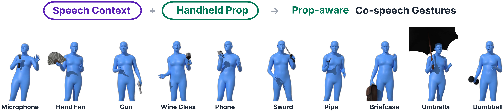

# PropGesture: Few-shot Co-speech Gesture Synthesis for Handheld Props

#####  
 [Jiho Kang*](https://dk-jang.github.io), [Junghoon Choi*](https://linkedin.com/in/dongseok-yang-868045203), [Jihun Shin](https://linkedin.com/in/deok-yun-jang-a2851b161), and [Sung-Hee Lee](https://lava.kaist.ac.kr/?page_id=41)

 
#### 
[Project Page](https://be9904.github.io/propgesture/) | Demo video

    

## License
This project is only for research or education purposes, and not freely available for commercial use or redistribution. 
The dataset is available only under the terms of the [Attribution-NonCommercial 4.0 International](https://creativecommons.org/licenses/by-nc/4.0/legalcode) (CC BY-NC 4.0) license.